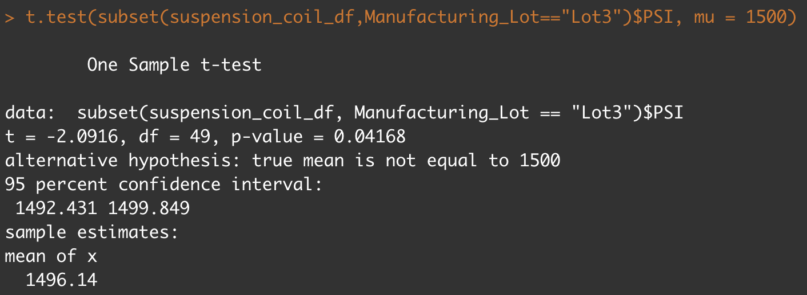

# MechaCar Statistical Analysis
Statisitical analysis of automobile performance with R

## Overview
A few weeks after starting his new role, Jeremy is approached by upper management about a special project. AutosRUs’ newest prototype, the MechaCar, is suffering from production troubles that are blocking the manufacturing team’s progress. AutosRUs’ upper management has called on Jeremy and the data analytics team to review the production data for insights that may help the manufacturing team.

In this challenge, I'll help Jeremy and the data analytics team do the following:

 - Perform multiple linear regression analysis to identify which variables in the dataset predict the mpg of MechaCar prototypes
 - Collect summary statistics on the pounds per square inch (PSI) of the suspension coils from the manufacturing lots
 - Run t-tests to determine if the manufacturing lots are statistically different from the mean population
 - Design a statistical study to compare vehicle performance of the MechaCar vehicles against vehicles from other manufacturers. For each statistical analysis, you’ll write a summary interpretation of the findings.

## Results

### Linear Regression to Predict MPG

* The Vehicle Length (VL) and Ground Clearance (GMC), both of which have been found to be strong indicators of fuel economy, are the most significant factors in our dataset that have a non-random influence on the MPG of the MechaCar. A linear regression model ran on these variables against figures for MPG yielded p-values of 2.6x10sup>-12/sup> and 5.21x10sup>-8/sup>, respectively, as represented by the yellow arrows in the graphic above. The intercept was also statistically significant, indicating that there are likely more factors that have a large influence on the MPG that are not included in our dataset.
* The linear model's slope cannot be regarded zero since the p-value of 5.35x10sup>-11/sup>, as indicated by the orange arrow above, is less than even an extreme degree of significance, requiring the null hypothesis to be rejected. This suggests that the association between our variables and miles per gallon is more than just a coincidence.
* Despite the fact that there are still unknown variables, this model can reasonably forecast the mpg of the MechaCar prototype. The purple box highlights the r-squared value of 0.7149, which suggests that the model is 71% accurate.

### Summary Statistics on Suspension Coils

* While the total variation is under 100 psi and fulfills requirements, there is an issue with one of the individual lots, as seen in the Total Summary data above. The variation for Lot 3 is significantly beyond the permitted level, at 170.28, as seen in the Lot Summary statistics.

### T-Tests on Suspension Coils
Suspension Coils Cumulative T-test

* The T-test findings for the suspension coils across all manufacturing lots demonstrate that they are not statistically different from the population mean, and the p-value (0.0603) is not low enough to reject the null hypothesis.

* The suspension coils for Lot 1 are not statistically different from the population mean, and the p-value is not low enough (1) to reject the null hypothesis, according to the results of the T-test.

* A review of the T-test results for Lot 2 suspension coils reveals that they are not statistically different from the population mean, and the p-value (0.6072) is not low enough to reject the null hypothesis.

* The suspension coils for Lot 3 are marginally statistically different from the population mean, according to the T-test findings, and the p-value is just low enough (0.0417) to reject the null hypothesis. This lot may need to be deleted or at the very least reviewed more thoroughly.

## Study Design: MechaCar vs Competition
 - When deciding whether or not to buy an automobile, shoppers evaluate a number of criteria. Customers wanting to buy a car, on the other hand, are searching for more than just a mode of transportation in a world where ridesharing is becoming more common and it's simple and cheap to move around in other people's vehicles. They will be seeking for an automobile that is a cost-effective way to carry themselves and their belongings on a daily basis.
### Metric to test
 - To narrow down our test, we should compare the carrying capacity of MechaCar to that of several rivals' vehicles in cubic inches.
### Null and Alternate Hypothesis
 - Hsub>0/sub>: The average carrying capacity of MechaCar prototypes is comparable to that of competitors in the same vehicle class. Hsub>a/sub>: The average carrying capacity of MechaCar prototypes is statistically higher or lower than that of rival vehicles.
### Statistical Test Used
 - Two-sample t-tests are the best statistical test for this.
### What data is needed
 - We'd need to collect cubic space data from all MechaCar prototypes' carrying compartments, as well as from all main rival cars.
